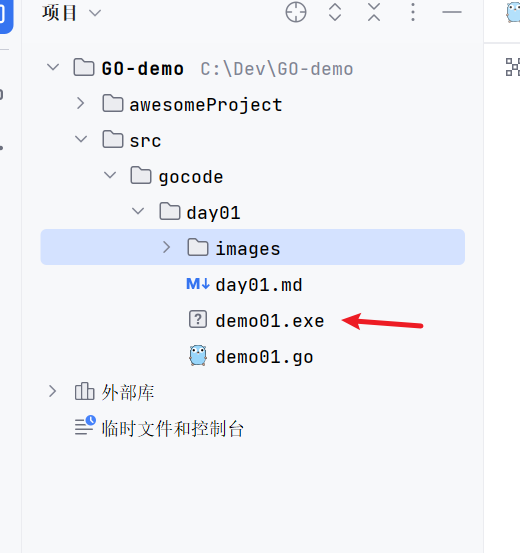
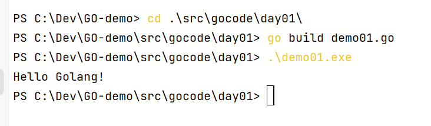

### GO语言 day01

```go
// 声明文件所在的包, 每个go文件必须有归属的包
package main

//引入程序中需要用的包 , 为了使用包下的函数
import "fmt"

// main 主函数  程序的入口
func main() {
	fmt.Print("Hello Golang!") //在控制台打印输出一句话 , 双引号中的内容会原样输出
}
```

写入这段代码

#### go build

**编译**

在控制台中跳转到这个go文件所在得了路径 输入

```shell
go build <GO工程名称>

来进行编译.go文件
```

得到一个 < GO工程名称 >.exe 的文件


#### 运行命令

**运行**

```shell
.\<GO工程名称>.exe 来运行
运行
```



##### go run

**直接编译并运行**

```shell
go run <GO>
直接编译并运行
```
