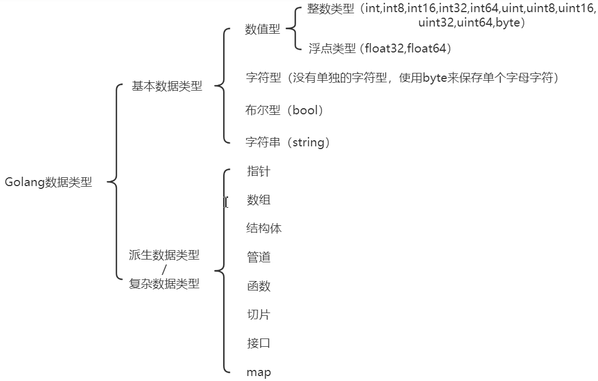

### 变量

##### 1.变量的使用步骤

1. 声明
2. 赋值
3. 使用

```go
package main

import "fmt"

func main() {
  // 1.变量的声明
  var age int
  // 2.变量的赋值
  age = 18
  // 3.变量的使用
  fmt.Println("age=", age)

  //声明和赋值合成一句
  var age2 int = 12
  fmt.Println("age2=", age2)

  /*
  	变量的重复定义会报错
  	# command-line-arguments
  	.\main.go:17:6: age redeclared in this block
  	.\main.go:7:6: other declaration of age

  	var age int = 20
  	fmt.Println(age)
  */

  //不能给不匹配的类型
  /*
  	var num int = 12.56
  	fmt.Println("num = ", num)
  */
}

```

##### 2.变量的四种使用形式

```go
package main

import "fmt"

func main() {
  //第一种：变量的使用方式
  var num int = 18
  fmt.Println(num) //18

  //第二种：指定变量的类型，但不赋值，使用默认值打印
  var num2 int
  fmt.Println(num2) //0

  //第三种：如果没有写变量的类型，那么会根据=后面的值进行判定变量的类型 (自动类型推断)
  var num3 = "tom"
  println(num3)

  //第四种：省略var关键字,注意 := 不能写为=
  sex := "男"
  fmt.Println(sex) //男

}

```

##### 3.一次性声明多变量

go语言支持多变量声明

```go
    // 声明多个变量
var n1, n2, n3 int
fmt.Println(n1, n2, n3)

name1 := true
println(name1)
fmt.Println(name1)

// 声明多个变量且赋值
var n4, name, n5 = 10, "jack", 7.8
fmt.Println(n4, name, n5)

n6, height := 6.9, 100.6
fmt.Println(n6, height)
```

##### 4.局部变量与全局变量

```go
定义在{}外为全局变量
var n7 = 100
var n8 = 9.7

var (
n9 = 100
n10 = "netty"
)
```

全局变量: 定义在函数外的变量
**注意:** 全局与局部变量重名会使用局部变量

局部变量: 定义在{}中的变量叫局部变量

###### 整体代码

```go
package main

import "fmt"

// 全局变量: 定义在函数外的变量
// 全局与局部变量重名会使用局部变量
var n7 = 100
var n8 = 9.7

var (
  n9  = 100
  n10 = "netty"
)

func main() {
  //定义在{}中的变量叫局部变量

  //第一种：变量的使用方式
  var num int = 18
  fmt.Println(num) //18

  //第二种：指定变量的类型，但不赋值，使用默认值打印
  var num2 int
  fmt.Println(num2) //0

  //第三种：如果没有写变量的类型，那么会根据=后面的值进行判定变量的类型 (自动类型推断)
  var num3 = "tom"
  println(num3)

  //第四种：省略var关键字,注意 := 不能写为=
  sex := "男"
  fmt.Println(sex) //男

  fmt.Println("---------------------------------------")

  // 声明多个变量
  var n1, n2, n3 int
  fmt.Println(n1, n2, n3)

  name1 := true
  println(name1)
  fmt.Println(name1)

  // 声明多个变量且赋值
  var n4, name, n5 = 10, "jack", 7.8
  fmt.Println(n4, name, n5)

  n6, height := 6.9, 100.6
  fmt.Println(n6, height)

  fmt.Println(n7, n8)
  fmt.Println(n9, n10)
}

```

### Golang中的数据类型

Golang数据类型: 基本数据类型,派生数据类型/复杂数据类型


##### 1.基本数据类型包括:

* 数值型
  * 整数类型(int,int8,int16,int32,int64,uint,uint16,uint32,uint64,byte)
  * 浮点类型(float32,float64)
* 字符型(没有单独的字符型,使用byte来保存单个字母字符)
* 布尔型(bool)
* 字符串(string)
*

###### 1.1有符号整数类型

| 类型 | 有无符号 | 占用存储空间 | 表数范围 |

##### 2.派生数据类型/复杂数据类型

* 指针
* 数组
* 结构体
* 管道
* 函数
* 切片
* 接口
* map
* ......

### 进制与进制转换

